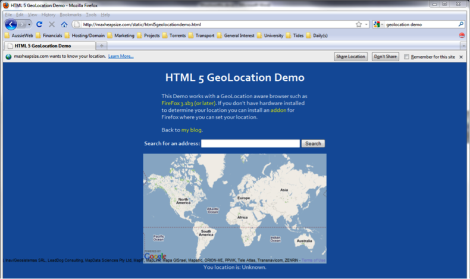

Woolworths Limited stands to gain a substantial technical advantage over its competitors through the strategic use of public facing information systems.

# Table of Contents

1. Summary
2. History and Operational Context
3. Typical Offline (In store) Customer Behaviour
3.1 Survey Results
4. Possible Areas of Improvement
4.1 Awareness of the Current Weekly Specials
4.2 Geolocation
4.3 Email Delivery of weekly specials
4.4 Awareness of store layout and product placement locations
5. Conclusion
6. Reference List

# 1. Summary
Woolworths Limited stands to gain a substantial technical advantage over its competitors through the strategic use of public facing information systems. Implementation of location aware online services for both Personal computer and smart phone have the potential to drastically reduce the amount of time that Woolworths customers spend looking for information and increase the convenience factor of shopping at Woolworths stores.

# 2. History and Operational Context
Woolworths Limited, founded in Sydney, Australia in September of 1924 is the largest retailing group and second largest private employer in Australia. Woolworths started life as “Wallworths Bazzar Limited”, a take on the F.W. Woolworths (now Foot Locker Inc) name. Woolworths focuses on the Australian and New Zealand retail sectors. Woolworths Limited operates a under a number of brands, including: Woolworths, Safeway, Thomas Dux, ALH Group, BWS, Dan Murphy’s, Langton, Big W, Dick Smith, Tandy, Countdown, Foodtown, Fresh Choice and SuperValue.

Woolworths has a strong market share, currently commanding 30% of the Australian food, liquor and grocery market (InvestSMART: Woolworths Limited (WOW) 2010), with reported 2009 financial year sales in the range of $49.6 billion dollars (Woolworths Limited, 2009, p.3).

Woolworths has a high level of commitment to their staff, the community, and the environment but most importantly Woolworths values their customers. Woolworths stated strategy is to provide customers with greater convenience, quality, lower prices and better value, range, freshness and service, (Woolworths Limited 2009, p.25).

Woolworths offers a range of incentives to help retain customers, including the weekly “Fresh food sales” and the Everyday Rewards Program, which allows shoppers to earn Qantas frequent flyer points & a 4c per litre discount on fuel purchases made via co-branded petrol stations.  Woolworths see the Everyday Rewards Program as an integral part of their sales process (Woolworths Limited 2009, p.8).

# 3. Typical Offline (In store) Customer Behaviour
We surveyed a range of Woolworth’s customers, asking 7 basic questions:

- Do you or a member of your Family/Household shop at Woolworths?
- How many times per week, on average, do you visit a grocery store?
- Before visiting a grocery store do you check the available specials for that week? I.e. Woolworths Weekly Specials or Coles Red Spot Specials?
- Have you ever used the Woolworths Website to check the Weekly Specials?
- Did you know that Woolworths has an online shopping facility?
- How do you feel about the possibility of receiving weekly grocery specials via email?
- Did you know that Woolworths has a smart phone (iPhone, Android etc.) compatible website?

## 3.1 Survey Results
Of the total number of customers surveyed 80% said that they or a member of their family / household shopped at Woolworths. Of those 80%, 60% visits a grocery store, one to two times per week, 35% visited less than once per week, and 5% visited three to four times per week.

All respondents stated that they did not check the available specials for the week before visiting a grocery store. We have marked this as a possible area for improvement.

All respondents stated that they have not used the Woolworths Website to check for Weekly specials. We have marked this as a possible area for improvement.

Of the total number of customers surveyed, 80% stated that they were aware of Woolworths’ online shopping facilities.  20% responded that they were not aware of the online shopping facilities.

Of the total number of customers surveyed, 16.7% said they were happy to receive emails from Woolworths in relation to its weekly specials, 66.7% said they were okay with the idea and 16.7% stated that they did not want to receive email from Woolworths. We have marked this as a possible area for improvement.

Of the total number of customers surveyed, 90% stated that they did not know Woolworths had a smart phone compatible website. We have marked this as a possible area for improvement.

Observations were also made in regards to purchasing and general movement of customers whilst in store:

It was noticed that most customers were purchasing a small number of goods and using the express checkout or self-service check out options.

Customers were often asking employees for directions or locations of specific items and goods within the store. We have marked this as a possible area for improvement.

Customers regularly made purchasing decisions based on the price per unit indicators. i.e.; Toilet Paper pricing has the unit price along with a price per 100 sheets. This made for easy price comparison between competing brands.

Customer service provided by staff was generally provided in a timely manner and of a high standard.

Informal discussions were also held with the general public in order to gauge the general knowledge of Woolworths Mobile/Smart phone internet offerings. However no quantitative data was recorded from those discussions.

# 4. Possible Areas of Improvement
As a result of our survey and in-store observations we have identified two key areas that we feel may be improved through the appropriate use of available Information Technologies, and reflect Woolworths strategic goals.

These are:

- Awareness of the current weekly specials.
- Awareness of store layout and product placement locations.

## 4.1 Awareness of the Current Weekly Specials
One of Woolworths’ stated strategic goals is to provide its customers with better value; one way Woolworths does this is to provide weekly specials on various items to its customers, these specials vary from location to location as supply and demand dictates.

Currently Woolworths’ weekly specials are delivered in 2 formats:

Physical print brochures, delivered to residential address in the areas surrounding store locations.

Online format: 
Personal computer (PC) compatible version available online via <http://www.woolworths.com.au>
Smart phone compatible version available online via <http://i.woolworths.com.au>

However as our survey results have demonstrated, Woolworths’ customers are not taking advantage of the weekly special information provided in these formats. We believe this is due to the significant barriers presented when trying to find information in relation to the customer’s physical location, along with the lack of electronic mail delivery of the weekly specials to interested customers.

## 4.2 Geolocation
When we consider the smart phone compatible version of the Woolworths website, it requires up to 5 actions on the users behalf before they are able to view the weekly specials relevant to their location (Sequence 1). The PC compatible version requires a similar number of steps, before redirecting to a third party website.

The number of steps required before being able to view the weekly specials could be drastically reduced by making both the smart phone and PC versions of the Woolworths’s website location aware. This can be done via the Geographic Location Application Programming Interface (geolocation API) available as part of the HTML5 standard (W3C 2010). The geolocation API is a client side technology which allows users to make a decision to share their current location with Woolworths’ website server (Figures 1 & 2).

The geolocation API provides the users location as latitude and longitude coordinates, which can then be used to locate the closet Woolworths store location to the user.

Currently iPhone, Android and Palm smart phones support the use of geolocation API’s along with the popular Firefox (Figure 3 & 4), Chrome and Safari PC desktop browsers. Other devices and browsers that do not support geolocation API’s can be gracefully degraded to the current, or a more streamlined version of the current website.

At this stage Woolworths’ major competitors (e.g. Coles) are yet to implement this technology. This presents an opportunity for Woolworths to be the market leader in the use of geographic targeting to deliver relevant information to its customers based on their physical location.

As the geolocation API is a client side technology no additional infrastructure purchases are necessary on Woolworths’ part, however there is an investment requirement to make the appropriate code changes to both website database (backend) and public facing PC and smart phone websites in order to properly support geolocation features.

Once in place, geolocation technology could easily be implemented on within other sections of the Woolworths website. A prime candidate would be the Price Check feature.

There are numerous benefits associated with this technology, they are:

- Increased customer awareness of the weekly specials available to them in their geographic location.
- Increased ability to record the location of Woolworths customers locations when using the Woolworths websites.

## 4.3 Email Delivery of weekly specials
Woolworths does not currently distribute its weekly specials to its customers via email. In our survey we asked Woolworths’ customers if they were comfortable with receiving weekly emails containing information relating to the weekly specials offered by Woolworths. 83.4% of customers surveyed responded favourably to this idea.

Currently Woolworths’ major competition, Coles, operates an eNewsletter, which Coles uses to convey information about its weekly specials, competitions and other news related to Coles (Fig 5 & 6).

Email newsletters are a proven low cost, measurable, communication method. There are numerous Email Marketing service providers who specialises in large scale mass mail-outs for corporate clients, such as Vision6 (Vision6: Our Clients 2010) and Gen3Media (Gen3Media: Corporate 2010). Each of these providers allows for personalisation of the emails sent to each customer based on a number of customisable factors. 

These could include:

- Customers geographic location
- Customers previous purchasing habits
- Customers indicated items of interest i.e.; Health Foods, Fresh fruit or vegetables etc.

As Email Marketing is provided as “Software as a Service” by a third party provider no additional infrastructure would need to purchase on the part of Woolworths. A small investment would need to be made on modifying the Woolworths PC website to accommodate email capture to be used with the Email Marketing services.

Benefits of the proposed weekly email system include:

- Increased level of communication with customers.
- Increased customer awareness of available weekly specials

## 4.4 Awareness of store layout and product placement locations
During in-store observations of Woolworths’ customers, a recurring pattern of user behaviour was recorded: Customers often had trouble finding a specific product’s location within the store.  The current process for customers to find a specific product would be to look walk around the store, possibly reading the isle signs, finally they would ask a staff member to point them in the right direction. This process while functional is somewhat time consuming, both on behalf of the customer and the staff member, and doesn’t satisfy Woolworth’s strategic goal of providing its customers with greater convenience.

We suggest making available, online (via PC and smart phone) a detailed isle map of product locations for each store, similar in function to Google Maps. A customer could search for a product by product name or product type and have that products location displayed on a store map, allowing them to easily navigate to the correct area of the store to retrieve the product.

This system could also be integrated with the weekly specials and inventory management systems of each store in order to provide the best possible information to the customer. As an example: A customer may search for toilet paper in the Moorooka store, the system would then provide a map showing where in the store toilet paper is located, along with the relevant weekly special information for that group of products and inventory levels of popular brands of toilet paper.

A system of this type would require a substantial investment in mapping & inventory tracking technologies in order to accurately track and place items within any given store. There would also need to be substantial investment in both PC and smart phone version of the Woolworths website in order to provide a seamless experience for the customer in order to allow them to easily and quickly locate the desired product.

Again at this stage none of Woolworths’ major competitors (eg. Coles) have implemented this type of system. This presents an opportunity for Woolworths to be the market leader in this type of integrated online/offline customer service.

There are a number of benefits associated with this type of system, not only from the customers prospective, but also for the efficiency of Woolworths’ in-store operations.

From the customers perspective a product mapping and location systems allows for:

- Decreased periods of time spent waiting for assistance.
- Decreased periods of time spent looking for specific products.
- Increased levels of convenience when searching for products.
- Increased awareness of potential savings or specials.

From Woolworths’ operation perspective a product mapping and location system allows for:

- Decrease in the amount of interruptions to staff performing stocking, or re-shelving duties.
- Decrease in the number of staff needed to effectively manage customers’ expectations in-store. Resulting in HR cost savings.

# 5. Conclusion
Surveys indicated that Woolworths’ customers are currently either not aware of or are not taking advantage of Woolworths’ weekly specials. Additional in-store observations indicated that customers often had issues locating specific products whilst shopping at Woolworths stores.

We have recommended the introduction of three online (PC and smart phone) technologies that we believe will help Woolworths’ offline customers to overcome these issues. They are:

- Develop and implement location aware services (geolocation API) for Woolworths PC and smart phone websites to help with the delivery of weekly specials and other information specific to the customer’s geographic locations, i.e. Price Check information.
- Develop and implement electronic mail delivery of weekly specials.
- Develop and implement in-store mapping services to help Woolworths’ customer’s location specific products in store without assistance from Woolworths’ staff members.

Currently none of Woolworths major competitors make use of geolocation technologies or in-store mapping technologies. This presents Woolworths with an opportunity to become a market leader in the adoption of these technologies.

# 6. Reference List:
InvestSMART: Woolworths Limited (WOW), 2010, viewed 4th May 2010,
[http://www.investsmart.com.au/shares/asx/Woolworths-WOW.asp](http://www.investsmart.com.au/shares/asx/Woolworths-WOW.asp)

Gen3Media: Corporate, 2010, viewed 7th May 2010,
[http://www.gen3media.com.au/index.php?option=com_content&task=view&id=43&Itemid=70](http://www.gen3media.com.au/index.php?option=com_content&task=view&id=43&Itemid=70)

Vision6: Our Clients, 2010, viewed 7th May 2010,
[http://www.vision6.com.au/our_clients.html](http://www.vision6.com.au/our_clients.html)

W3C (2009), ‘Geolocation API Specification’, 2010, viewed 9th May 2010,
[http://www.w3.org/TR/geolocation-API/](http://www.w3.org/TR/geolocation-API/)

Woolworths Limited (2009), ‘Annual Report’
[http://thomson.mobular.net/thomson/7/3022/4089/](http://thomson.mobular.net/thomson/7/3022/4089/)