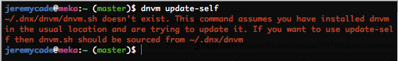
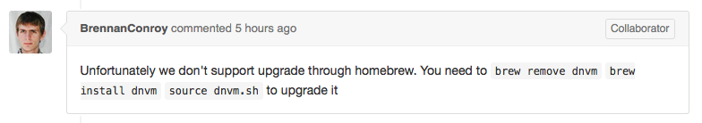

Continuing on from the [#687: dnu restore broken](https://github.com/aspnet/Home/issues/687) issue; A number of people are still finding this to be an issue. The recommended fix at this stage is to update `dnvm` to the latest version with `dnvm update-self`.

If you, like me have installed `dnvm` on OS X via Homebrew, you will run into the following issue: 


**Figure: dnvm update expects dnvm directory in .dnx folder**

As you can see from the following `tree .dnx` output, the `dnvm` directory is not present.

```
.dnx/
├── alias
│   └── default.alias
└── runtimes
    ├── dnx-mono.1.0.0-beta4
    │   ├── bin
    │   │   ├── Microsoft.CodeAnalysis.CSharp.Desktop.dll
    │   │   ├── Microsoft.CodeAnalysis.CSharp.dll
    │   │   ├── Microsoft.CodeAnalysis.Desktop.dll
    │   │   ├── Microsoft.CodeAnalysis.dll
    │   │   ├── Microsoft.Framework.ApplicationHost.dll
    │   │   ├── Microsoft.Framework.DesignTimeHost.Interfaces.dll
    │   │   ├── Microsoft.Framework.Runtime.Interfaces.dll
    │   │   ├── Microsoft.Framework.Runtime.Loader.dll
    │   │   ├── Microsoft.Framework.Runtime.Roslyn.Common.dll
    │   │   ├── Microsoft.Framework.Runtime.Roslyn.Interfaces.dll
    │   │   ├── Microsoft.Framework.Runtime.Roslyn.dll
    │   │   ├── Microsoft.Framework.Runtime.dll
    │   │   ├── Newtonsoft.Json.dll
    │   │   ├── System.Collections.Immutable.dll
    │   │   ├── System.Reflection.Metadata.dll
    │   │   ├── dnu
    │   │   ├── dnx
    │   │   ├── dnx.host.dll
    │   │   ├── dnx.mono.managed.dll
    │   │   └── lib
    │   │       ├── Microsoft.Framework.DesignTimeHost
    │   │       │   ├── Microsoft.Framework.DesignTimeHost.dll
    │   │       │   └── Microsoft.Framework.NotNullAttribute.Internal.dll
    │   │       ├── Microsoft.Framework.PackageManager
    │   │       │   └── Microsoft.Framework.PackageManager.dll
    │   │       └── Microsoft.Framework.Project
    │   │           └── Microsoft.Framework.Project.dll
    │   ├── dnx-mono.nuspec
    │   └── package
    │       └── services
    │           └── metadata
    │               └── core-properties
    │                   └── ddd70229659a44fe8e4fbc08b9d84d87.psmdcp
    └── dnx-mono.1.0.0-beta6
        ├── bin
        │   ├── Microsoft.CodeAnalysis.CSharp.dll
        │   ├── Microsoft.CodeAnalysis.dll
        │   ├── Microsoft.Framework.ApplicationHost.dll
        │   ├── Microsoft.Framework.DesignTimeHost.Abstractions.dll
        │   ├── Microsoft.Framework.Runtime.Abstractions.dll
        │   ├── Microsoft.Framework.Runtime.Caching.dll
        │   ├── Microsoft.Framework.Runtime.Compilation.DesignTime.dll
        │   ├── Microsoft.Framework.Runtime.Loader.dll
        │   ├── Microsoft.Framework.Runtime.Roslyn.Abstractions.dll
        │   ├── Microsoft.Framework.Runtime.Roslyn.Common.dll
        │   ├── Microsoft.Framework.Runtime.Roslyn.dll
        │   ├── Microsoft.Framework.Runtime.dll
        │   ├── System.Collections.Immutable.dll
        │   ├── System.Reflection.Metadata.dll
        │   ├── dnu
        │   ├── dnx
        │   ├── dnx.host.dll
        │   ├── dnx.mono.managed.dll
        │   └── lib
        │       ├── Microsoft.Framework.DesignTimeHost
        │       │   ├── Microsoft.Framework.DesignTimeHost.dll
        │       │   ├── Microsoft.Framework.NotNullAttribute.Sources.dll
        │       │   └── Newtonsoft.Json.dll
        │       ├── Microsoft.Framework.PackageManager
        │       │   ├── Microsoft.Framework.NotNullAttribute.Sources.dll
        │       │   ├── Microsoft.Framework.PackageManager.dll
        │       │   └── Newtonsoft.Json.dll
        │       └── Microsoft.Framework.Project
        │           └── Microsoft.Framework.Project.dll
        ├── dnx-mono.nuspec
        └── package
            └── services
                └── metadata
                    └── core-properties
                        └── 6586fbcfbbe442c4a108a4b34abfbae8.psmdcp

22 directories, 53 files
```

This is due to Homebrew installing packages into `/usr/local/Cellar/` and then symlinking to `/usr/local/bin` by default.

Normally I would advise updating `dnvm` via Homebrew like so:

`brew update; brew upgrade dnvm;`

However as [Brennan Conroy](https://github.com/BrennanConroy) mentions: "Unfortunately we don't support upgrade through homebrew".


**Figure: Unfortunately we don't support upgrade through homebrew.**

The correct method as of August 16th 2015 to upgrade `dnvm` if installed via Homebrew is the following: 

`brew remove dnvm; brew install dnvm;`